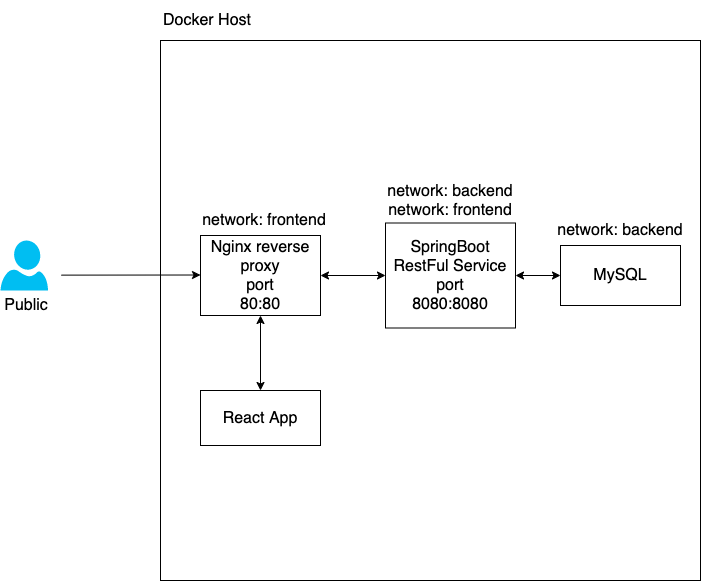

AWS traing homework - 1st
=========

A simple distributed application running across multiple Docker containers.

Getting started
---------------

Download [Docker Desktop](https://www.docker.com/products/docker-desktop) for Mac or Windows. [Docker Compose](https://docs.docker.com/compose) will be automatically installed. On Linux, make sure you have the latest version of [Compose](https://docs.docker.com/compose/install/). 


Run the app 
-------------------------

Run in this directory:
```
docker-compose up
```

Architecture
-----



